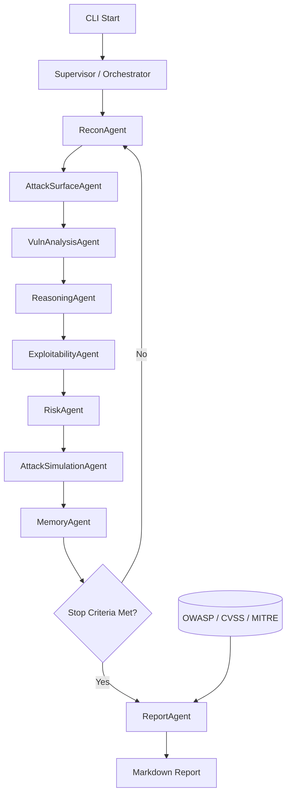

# 🧠 CortexSec - AI Autonomous Pentesting Agent

[](https://www.python.org/) [](#) [](./LICENSE) [](#-usage) [](#-features) [](https://github.com/RajaMuhammadAwais/Ai-pentest/actions/workflows/ci.yml)


CortexSec is a fully autonomous, CLI-based multi-agent framework for continuous security assessment of authorized targets. After execution, agents plan, reason, and coordinate independently to model attack surface, identify weaknesses, and evaluate exploitability without destructive actions.

## 🚀 Features

- **Multi-Agent Architecture**: Specialized agents for Recon, Vulnerability Analysis, Exploitability Analysis, and Reporting.
- **Closed-Loop Orchestrator**: Continuously plans, reasons, and coordinates agents until termination criteria are satisfied.
- **LLM-Agnostic**: Supports OpenAI, Claude, and Gemini (via extensible base class).
- **Lab-Safe Execution**: Built-in guards to prevent unauthorized targeting (localhost only in lab mode).
- **Professional Reporting**: Generates technical and executive reports with OWASP Top 10 and MITRE ATT&CK mapping.
- **Risk Scoring**: Automated risk assessment and remediation guidance.
- **Research-Based Quick Checks**: Adds deterministic OWASP-aligned HTTP security header checks for practical real-world hardening gaps.
- **Safe Attack Simulation Plans**: Generates non-destructive, authorization-first validation playbooks for each finding (no auto exploitation).
- **Agent Memory**: Stores recurring finding patterns to prioritize future assessments with simple self-improving logic.
- **Coverage, Confidence, and Causal Completeness Termination**: Stops only when reachable findings are analyzed and quality criteria are met (or max cycles is reached).
- **Attack-Graph Causal Reasoning**: Builds explainable causal paths from weakness to impact without running destructive attacks.
- **OWASP + CVSS + MITRE Reporting**: Findings are mapped to major security frameworks for professional reporting.

## 🛠 Installation

### Prerequisites
- Python 3.8+
- LLM API Key (OpenAI, Anthropic, or Google)

### Step-by-Step Setup

1. **Clone the Repository**
   ```bash
   git clone https://github.com/RajaMuhammadAwais/Ai-pentest.git
   cd Ai-pentest
   ```

2. **Create a Virtual Environment (Recommended)**
   ```bash
   python3 -m venv venv
   source venv/bin/activate
   ```

3. **Install Dependencies**
   ```bash
   pip install -e .
   ```

4. **Set Up Environment Variables**
   Create a `.env` file in the root directory:
   ```env
   OPENAI_API_KEY=your_openai_api_key
   # Optional: ANTHROPIC_API_KEY=your_claude_api_key
   # Optional: GOOGLE_API_KEY=your_gemini_api_key
   ```

### Linux Installation Guide (Ubuntu/Debian/Fedora/Arch)

If you are on Linux, follow this practical setup flow.

#### 1) Install Python + venv + pip

**Ubuntu / Debian**
```bash
sudo apt update
sudo apt install -y python3 python3-venv python3-pip git
```

**Fedora**
```bash
sudo dnf install -y python3 python3-pip git
```

**Arch Linux**
```bash
sudo pacman -S --needed python python-pip git
```

#### 2) Clone and enter project
```bash
git clone https://github.com/RajaMuhammadAwais/Ai-pentest.git
cd Ai-pentest
```

#### 3) Create and activate virtual environment
```bash
python3 -m venv .venv
source .venv/bin/activate
```

#### 4) Install CortexSec
```bash
pip install --upgrade pip
pip install -e .
```

#### 5) Configure API keys
```bash
cat > .env << 'EOF'
OPENAI_API_KEY=your_openai_api_key
# Optional: ANTHROPIC_API_KEY=your_claude_api_key
# Optional: GOOGLE_API_KEY=your_gemini_api_key
EOF
```

#### 6) Quick verification
```bash
cortexsec --help
```

## 🎯 Usage

### 1. Lab Mode (Safety First)
Test the agent against a local target. Lab mode strictly enforces `localhost` or `127.0.0.1` targets.
```bash
cortexsec start --target http://localhost:8080 --mode lab
```

### 2. Authorized Assessment
Perform an assessment on an authorized external target.
```bash
cortexsec start --target https://example.com --mode authorized --provider openai --max-cycles 4 --confidence-threshold 0.8 --coverage-threshold 0.8 --causal-threshold 1.0 --min-stable-cycles 1
```

### 3. Custom API Key
You can also provide the API key directly via the CLI:
```bash
cortexsec start --target https://example.com --mode authorized --api-key YOUR_API_KEY
```


## 🕸️ Architecture Graph



For a standalone copy of this graph, see `docs/architecture_graph.md`.

## 📊 Reports
After the assessment completes, a professional Markdown report is generated in the `reports/` directory. The report includes:
- **Executive Summary**: High-level overview for management.
- **Detailed Findings**: Technical breakdown of identified vulnerabilities.
- **Remediation Guidance**: Actionable steps to fix issues.
- **Compliance Mapping**: OWASP Top 10 and MITRE ATT&CK context.

## ⚖️ Legal Disclaimer

**IMPORTANT:** This tool is for authorized security testing purposes only. Unauthorized access to computer systems is illegal. The developers assume no liability for any misuse or damage caused by this tool. By using this software, you agree to only target systems you own or have explicit, written permission to test.