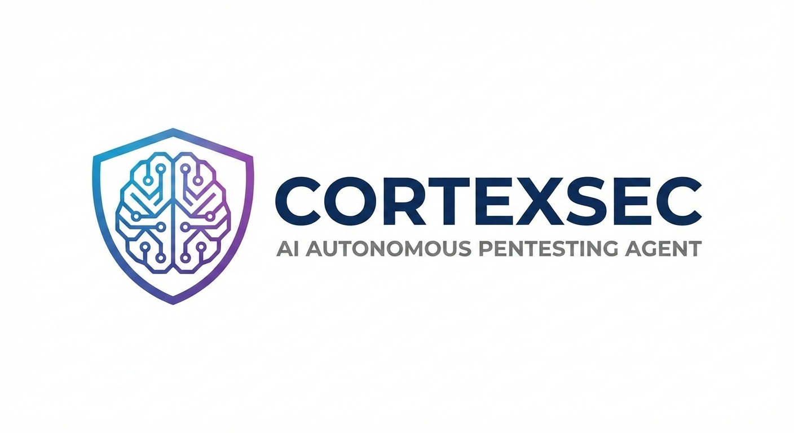

# 🧠 CortexSec - AI Autonomous Pentesting Agent



<!-- Project Description -->
<!-- 
CortexSec: Advanced AI-powered autonomous pentesting and vulnerability assessment platform. 
Multi-agent security framework for OWASP compliance, CVSS scoring, and MITRE ATT&CK mapping. 
Python CLI tool for continuous security testing with LLM support.
-->

**Status & Quick Links**

[](https://www.python.org/) 
[](#-release) 
[](./LICENSE) 
[](#-usage) 
[](#-features)

**Build & Quality**

[](https://github.com/RajaMuhammadAwais/CortexSec/actions/workflows/ci.yml)
[](https://github.com/RajaMuhammadAwais/CortexSec/actions/workflows/release.yml)
[](https://pep8.org/)

**Integrations**

[](https://openai.com/)
[](https://anthropic.com/)
[](https://google.com/)

---

## What is CortexSec?

**CortexSec** is a fully autonomous, CLI-based multi-agent framework for continuous **vulnerability assessment**, **security testing**, and **penetration testing** of authorized targets. Using advanced AI agents, CortexSec automatically plans, reasons, and coordinates to:

- Model your **attack surface** comprehensively
- Identify security weaknesses and vulnerabilities
- Evaluate exploitability with high confidence
- Generate professional reports mapped to **OWASP Top 10**, **CVSS**, and **MITRE ATT&CK**

All without destructive actions. Perfect for **security researchers**, **penetration testers**, and **DevSecOps teams**.

---

## 📋 Table of Contents

- [Autonomy Implementation Plan](#-autonomy-implementation-plan)
- [What is CortexSec?](#what-is-cortexsec)
- [Why Choose CortexSec?](#why-choose-cortexsec)
- [Features](#-features)
- [How It Works](#-how-cortexsec-works---architecture--execution)
- [Installation](#-installation--setup)
- [Usage](#-usage--running-security-assessments)
- [Reports](#-generated-security-reports)
- [Release Notes](#-release--versioning)
- [Legal Disclaimer](#-legal-disclaimer)

---

## Why Choose CortexSec?

### For Security Teams
- **Automate Penetration Testing**: Reduce manual effort while maintaining high-quality assessments
- **Continuous Assessment**: Run regular security scans without dedicated pentester time
- **Evidence-Based Decisions**: CVSS and OWASP mappings support compliance and prioritization

### For Developers & DevSecOps
- **Shift-Left Security**: Catch vulnerabilities early in development
- **Non-Destructive Testing**: Safe to run in lab and staging environments
- **AI-Powered Analysis**: Leverage LLM reasoning for deeper vulnerability insights

### For Security Researchers
- **Open Architecture**: Extensible LLM support and agent framework
- **Academic-Grade Reporting**: MITRE ATT&CK and causal reasoning for research
- **Customizable Agents**: Build specialized assessment agents for your domain

### Core Capabilities
- **Multi-Agent Autonomous Architecture**: Specialized agents for reconnaissance, vulnerability discovery, exploitability analysis, and reporting
- **Closed-Loop Intelligent Orchestrator**: Continuously plans, reasons, and coordinates agents for comprehensive vulnerability assessment
- **Policy-Bounded Autonomy**: Enforces non-destructive penetration testing and authorized-target-only security assessment
- **LLM-Agnostic Support**: Works with OpenAI, Anthropic Claude, Google Gemini, and DeepSeek R1 via extensible architecture
- **Terminal & Tool-Assisted Reasoning**: Agents can execute approved terminal workflows and security tools, preserve command/output provenance, and apply evidence-driven logic to validate exploitability and vulnerability confidence

### Security Assessment & Analysis
- **Comprehensive Attack Surface Modeling**: Identifies and maps your application's security weaknesses
- **OWASP Top 10 Scanning**: Automated detection of critical web vulnerabilities
- **CVSS Risk Scoring**: Scientific vulnerability severity assessment
- **MITRE ATT&CK Mapping**: Threat-based vulnerability categorization and analysis
- **Exploitability Evaluation**: Assesses real-world attack feasibility without destructive actions
- **Attack-Graph Causal Reasoning**: Builds explainable vulnerability paths from discovery to potential impact

### Intelligence & Learning
- **Agent Memory System**: Learns from patterns to improve future assessments
- **Hierarchical Reinforcement Learning**: Adapts assessment focus based on confidence, coverage, and uncertainty reduction
- **Smart Termination Logic**: Stops only when high-confidence exploitability is achieved or quality thresholds are met

### Reporting & Compliance
- **Professional Report Generation**: Technical and executive summaries with OWASP, CVSS, and MITRE mappings
- **Remediation Guidance**: Actionable steps for each finding with severity context
- **Compliance Mapping**: Aligns findings with industry security standards

### Safety & Control
- **Lab-Safe Execution Mode**: Built-in guards preventing unauthorized targeting
- **Non-Destructive Testing**: Safe attack simulation plans without actual exploitation
- **Human-Like Payload Testing Engine**: Canary, fuzz/boundary, logic-test, and real-world non-destructive payload execution with hypothesis-driven analysis
- **Scientific Perturbation Logic**: Paired control-vs-payload experiments with reproducibility checks for lower false positives in real-world testing
- **Authorization-First Validation**: Respects authorized scope boundaries

---


## 🚀 Autonomy Implementation Plan

We have started execution work using a dedicated, research-aligned implementation plan in:

- `docs/research/autonomy-implementation-plan.md`

This plan translates research into concrete project phases, acceptance criteria, and sprint backlog items for real autonomous capability delivery.

---

## 🏗 How CortexSec Works - Architecture & Execution

### Multi-Agent System Components

CortexSec employs a sophisticated distributed multi-agent framework:

- **Reconnaissance Agent**: Maps application attack surface, identifies entry points, and security exposure
- **Payload Injection Testing Agent**: Designs unique payloads with explicit hypotheses, injects safely, and observes behavior for validation/logic/auth boundary flaws
- **Vulnerability Analysis Agent**: Discovers weaknesses aligned with OWASP Top 10  classifications
- **Exploitability Agent**: Evaluates real-world attack feasibility and impact assessment
- **Memory Agent**: Learns from recurring patterns to improve assessment quality
- **Reasoning Agent**: Performs causal analysis, builds attack graphs, and makes strategic decisions
- **Report Agent**: Generates professional documentation with framework mappings

### Assessment Execution Flow

```
┌─ Start Assessment (Authorized Target)
├─ Reconnaissance Phase → Identify entry points & services
├─ Vulnerability Discovery → Scan for OWASP weaknesses
├─ Terminal/Tool Verification → Execute safe checks and collect evidence
├─ Exploitability Analysis → Assess attack feasibility (CVSS)
├─ Causal Reasoning → Build attack paths (MITRE ATT&CK)
├─ Confidence Evaluation → Check termination criteria met?
│   ├─ No → Loop to continue discovery
│   └─ Yes → Proceed to reporting
└─ Report Generation → Professional security assessment
```

### Key Intelligence Mechanisms

- **Hierarchical Reinforcement Learning**: Continuously adapts assessment strategy based on coverage, confidence, and uncertainty metrics
- **Attack-Graph Construction**: Builds explainable chains from vulnerability to business impact
- **Evidence-Based Exploit Decisions**: Correlates terminal outputs, tool findings, and behavioral observations before confirming exploitability
- **Non-Destructive Validation**: Simulates attacks in safe mode without system compromise
- **Pattern Recognition**: Uses memory to prioritize high-value findings in repeat assessments

### Evidence & Validation Framework (Research-Based)

To make exploit and vulnerability decisions more defensible, CortexSec follows established security-testing standards:

- **OWASP WSTG-Aligned Test Design**: Discovery and verification logic follows OWASP Web Security Testing Guide principles for repeatable web security testing.
- **NIST SP 800-115 Style Execution Discipline**: Terminal/tool runs are treated as structured technical tests with planning, evidence collection, and documented analysis.
- **PTES-Inspired Workflow Coverage**: Findings are contextualized across reconnaissance, vulnerability analysis, and reporting phases for operational realism.
- **FIRST CVSS v3.1 Severity Normalization**: Confirmed findings are scored using CVSS-style impact/exploitability dimensions to support prioritization.
- **MITRE ATT&CK Technique Mapping**: Validated behaviors are mapped to ATT&CK techniques to improve detection and defensive response planning.

Reference standards:
- OWASP Web Security Testing Guide (WSTG): https://owasp.org/www-project-web-security-testing-guide/
- NIST SP 800-115 Technical Guide to Information Security Testing and Assessment: https://csrc.nist.gov/publications/detail/sp/800-115/final
- Penetration Testing Execution Standard (PTES): http://www.pentest-standard.org/index.php/Main_Page
- FIRST CVSS v3.1 Specification: https://www.first.org/cvss/v3-1/specification-document
- MITRE ATT&CK Framework: https://attack.mitre.org/

### 🚀 Research-Backed Upgrades to Make Agents More Autonomous

If your goal is to make CortexSec agents significantly more powerful in real autonomous operations, prioritize these updates:

1. **Planner → Executor → Critic Multi-Agent Loop**
   - Add an explicit planning agent, execution agent, and critic/verifier agent with iterative self-correction before finalizing findings.
   - Why: modern agent research shows better task reliability when actions are proposed, executed, and independently critiqued.

2. **ReAct + Toolformer-Style Tool Calling**
   - Standardize all agent reasoning into `Thought → Action → Observation` traces and train prompts/policies for when tools should be called.
   - Why: improves grounded decisions, reduces hallucinated findings, and makes tool usage auditable.

3. **Reflexion-Style Failure Memory**
   - Persist "what failed + why" (payload families, false-positive patterns, dead-end exploit chains) and feed it into subsequent planning.
   - Why: autonomous agents improve faster when they learn from prior mistakes, not only successes.

4. **Policy-as-Code Safety Gates for Every Action**
   - Add pre-action and post-action guardrails (scope check, non-destructive check, rate-limit check, sensitive-endpoint check) as enforceable policies.
   - Why: keeps autonomy high while preserving legal/safety boundaries in continuous testing.

5. **Evidence Graph Instead of Flat Logs**
   - Convert command outputs into a graph: `target surface → test action → observation artifact → vulnerability hypothesis → confidence`.
   - Why: enables reproducible exploitability decisions and improves report explainability.

6. **Uncertainty-Aware Stopping Logic**
   - Move from fixed loop exits to uncertainty-based stopping (stop when marginal confidence gain drops below threshold).
   - Why: reduces wasted scans and improves focus on high-impact unresolved attack paths.

7. **Continuous Evaluation Harness (Agent Benchmarks)**
   - Add regression evaluation for autonomous behavior: precision/recall of findings, false-positive rate, reproducibility score, time-to-evidence.
   - Why: autonomy quality degrades without benchmark-driven iteration.

Suggested research references for these upgrades:
- ReAct (reasoning + acting): https://arxiv.org/abs/2210.03629
- Toolformer (self-supervised tool use): https://arxiv.org/abs/2302.04761
- Reflexion (verbal reinforcement/self-improvement): https://arxiv.org/abs/2303.11366
- NIST AI Risk Management Framework (governed AI operations): https://www.nist.gov/itl/ai-risk-management-framework
- MITRE ATLAS (adversarial threats against AI-enabled systems): https://atlas.mitre.org/

---

## 🛠 Installation & Setup

Get **CortexSec** running in minutes. Choose your installation method based on your platform.

### Prerequisites
- **Python 3.8+** (3.10+ recommended)
- **LLM API Key** (OpenAI GPT, Anthropic Claude, Google Gemini, or DeepSeek)
- **Git** for repository cloning
- **pip** for Python package management

### Quick Start (All Platforms)

1. **Clone the Repository**
   ```bash
   git clone https://github.com/RajaMuhammadAwais/CortexSec.git
   cd CortexSec
   ```

2. **Create a Virtual Environment (Recommended)**
   ```bash
   python3 -m venv venv
   source venv/bin/activate
   ```

3. **Install Dependencies**
   ```bash
   pip install -e .
   ```

4. **Set Up Environment Variables**
   Create a `.env` file in the root directory:
   ```env
   OPENAI_API_KEY=your_openai_api_key
   # Optional: ANTHROPIC_API_KEY=your_claude_api_key
   # Optional: GOOGLE_API_KEY=your_gemini_api_key
   # Optional: DEEPSEEK_API_KEY=your_deepseek_api_key
   ```

### Linux Installation Guide (Ubuntu, Debian, Fedora, Arch Linux)

Complete step-by-step guide for installing CortexSec on any Linux distribution.

#### Step 1: Install System Dependencies
Install Python 3, package manager, and Git

**Ubuntu / Debian**
```bash
sudo apt update
sudo apt install -y python3 python3-venv python3-pip git
```

**Fedora**
```bash
sudo dnf install -y python3 python3-pip git
```

**Arch Linux**
```bash
sudo pacman -S --needed python python-pip git
```

#### Step 2: Clone the Repository
Get the latest CortexSec source code from GitHub
```bash
git clone https://github.com/RajaMuhammadAwais/CortexSec.git
cd CortexSec
```

#### Step 3: Create and Activate Virtual Environment
Isolate CortexSec dependencies from system Python
```bash
python3 -m venv .venv
source .venv/bin/activate
```

#### Step 4: Install CortexSec and Dependencies
Install the package in development mode
```bash
pip install --upgrade pip
pip install -e .
```

#### Step 5: Configure LLM API Keys
Set up your OpenAI, Anthropic, Google, or DeepSeek credentials
```bash
cat > .env << 'EOF'
OPENAI_API_KEY=your_openai_api_key
# Optional: ANTHROPIC_API_KEY=your_claude_api_key
# Optional: GOOGLE_API_KEY=your_gemini_api_key
# Optional: DEEPSEEK_API_KEY=your_deepseek_api_key
EOF
```

#### Step 6: Verify Installation
Test that CortexSec is properly installed and accessible
```bash
cortexsec --help
```

> During install (`pip install -e .`), CortexSec prints an ASCII banner in terminal for confirmation.


### APT Package Installation (Debian & Ubuntu Linux)

Install CortexSec as a native Debian/Ubuntu system package with automatic dependency management.

CortexSec includes Debian packaging metadata for distribution as a native Linux package.

**Benefits of APT Installation:**
- System-wide access from any directory
- Automatic updates via standard package manager
- Easy uninstall with `sudo apt remove cortexsec`

```bash
sudo apt update
sudo apt install cortexsec
```

If the package is hosted in your internal or public APT repository, this installs CortexSec as a native system package.

### Automatic Updates via APT

Enable unattended upgrades so CortexSec updates automatically from configured APT repositories:

```bash
sudo apt install -y unattended-upgrades
sudo dpkg-reconfigure -plow unattended-upgrades
```

You can also manually update anytime:

```bash
sudo apt update && sudo apt install --only-upgrade cortexsec
```

## 🎯 Usage & Running Security Assessments

CortexSec supports multiple operational modes for different security testing scenarios.

### 1. Lab Mode - Safe Local Testing
Test and validate CortexSec against a local target. Lab mode strictly enforces `localhost` or `127.0.0.1` targets for safety.

**Perfect for:** Learning, validation, development environment testing
```bash
cortexsec start --target http://localhost:8080 --mode lab
```

### 2. Authorized Security Assessment
Perform comprehensive penetration testing on an authorized external target with advanced configuration.

**Perfect for:** Production security audits, authorized vulnerability assessments, compliance testing
```bash
cortexsec start --target https://example.com --mode authorized --provider openai --max-cycles 4 --confidence-threshold 0.8 --coverage-threshold 0.8 --causal-threshold 1.0 --exploitability-threshold 0.75 --min-stable-cycles 1
```

**Assessment Parameters:**
- `--target`: URL of the target application
- `--provider`: LLM provider (openai, claude, gemini, deepseek)
- `--max-cycles`: Maximum assessment iterations
- `--confidence-threshold`: Minimum confidence level for findings (0-1)
- `--coverage-threshold`: Minimum vulnerability coverage (0-1)
- `--exploitability-threshold`: Minimum exploitability confidence (0-1)

### 3. Custom API Key Configuration
Provide API key directly via CLI without environment variables.

```bash
cortexsec start --target https://example.com --mode authorized --api-key YOUR_API_KEY
```


## 📦 Release & Versioning

**Current Release:** [v0.3.0](docs/releases/v0.3.0.md)

CortexSec follows semantic versioning with regular updates. View detailed release notes and changelog in the [docs/releases/](docs/releases/) directory.

- **v0.3.0**: CortexSec rebranding, enhanced agent architecture, MITRE ATT&CK integration
- **Previous releases**: See release notes for feature history and breaking changes

### Update Instructions

**Python Package Update**
```bash
pip install --upgrade cortexsec
```

**From Source**
```bash
git pull origin main
pip install -e .
```

## 📊 Generated Security Reports

After each assessment completes, CortexSec generates comprehensive professional security reports in Markdown format, stored in the `reports/` directory.

### Report Contents

**Executive Summary**
- High-level overview for stakeholders and management
- Risk level summary
- Key findings overview

**Detailed Technical Findings**
- Identified vulnerabilities with proof-of-concept
- Weakness root cause analysis
- Attack vectors and exploitation paths

**Security Framework Mappings**
- **OWASP Top 10**: Alignment with current web vulnerability categories
- **CVSS Scores**: Severity ratings (Critical, High, Medium, Low)
- **MITRE ATT&CK**: Threat-based categorization with attack tactics & techniques

**Remediation & Risk Management**
- Actionable remediation steps for each finding
- Priority and timeline recommendations
- Best practices for hardening

### Example Report Structure
```
reports/example-com-assessment-2024-02-07.md
├── Executive Summary
├── Vulnerability Summary
├── Detailed Findings
│   ├── Finding 1: [OWASP] [CVSS 8.9]
│   ├── Finding 2: [MITRE] [CVSS 6.5]
│   └── Finding 3: [CVSS 4.2]
├── OWASP Top 10 Mapping
├── MITRE ATT&CK Mapping
├── Remediation Guidance
└── Assessment Metadata
```

---

## 🔗 Resources & Community

### Documentation
- [Release Notes](docs/releases/v0.3.0.md)
- [Architecture Documentation](docs/architecture_graph.md)
- [Contributing Guide](CONTRIBUTING.md)

### External Security Standards
- [OWASP Top 10 Web Application Security Risks](https://owasp.org/www-project-top-ten/)
- [CVSS - Common Vulnerability Scoring System](https://www.first.org/cvss/)
- [MITRE ATT&CK Framework](https://attack.mitre.org/)

### Related Tools & Projects
- [OWASP ZAP - Web Security Scanner](https://www.zaproxy.org/)
- [Burp Suite - Penetration Testing Platform](https://portswigger.net/burp)
- [OWASP Security Testing Guide](https://owasp.org/www-project-web-security-testing-guide/)

### Get Involved
- **Report Issues**: [GitHub Issues](https://github.com/RajaMuhammadAwais/CortexSec/issues)
- **Contribute**: Submit pull requests with improvements
- **Star**: Help spread awareness of the project

---

## ⚖️ Legal Disclaimer

**IMPORTANT:** This tool is for authorized security testing purposes only. Unauthorized access to computer systems is illegal. The developers assume no liability for any misuse or damage caused by this tool. By using this software, you agree to only target systems you own or have explicit, written permission to test.

---

## 🔐 Keywords & Topics

**Security Testing:** Penetration testing, vulnerability assessment, security scanning, authorized testing, non-destructive testing, lab-safe execution

**AI & Automation:** Autonomous agents, multi-agent systems, AI-powered security, LLM integration, machine learning, reinforcement learning, reasoning agents

**Security Standards:** OWASP Top 10, CVSS scoring, MITRE ATT&CK, attack surface, exploitability analysis, attack graphs, threat modeling

**Implementation:** Python, CLI application, GitHub actions, CI/CD, continuous security assessment, automated reporting, DevSecOps

**Platforms:** Linux (Ubuntu, Debian, Fedora, Arch), APT package management, Python virtual environments, Docker support

---

## 📄 License

CortexSec is released under the [MIT License](LICENSE). See LICENSE file for details.

---

**Developed by [RajaMuhammadAwais](https://github.com/RajaMuhammadAwais)** | [Report Security Issues](https://github.com/RajaMuhammadAwais/CortexSec/security) | [GitHub Repository](https://github.com/RajaMuhammadAwais/CortexSec)
