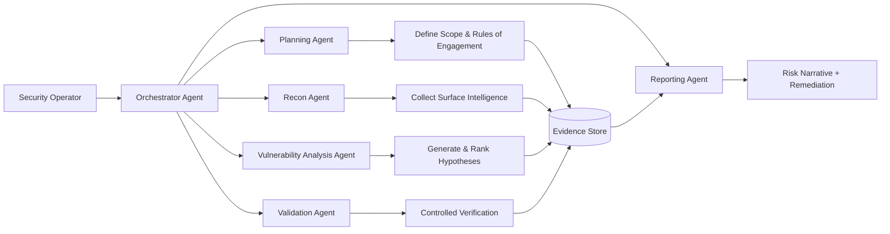
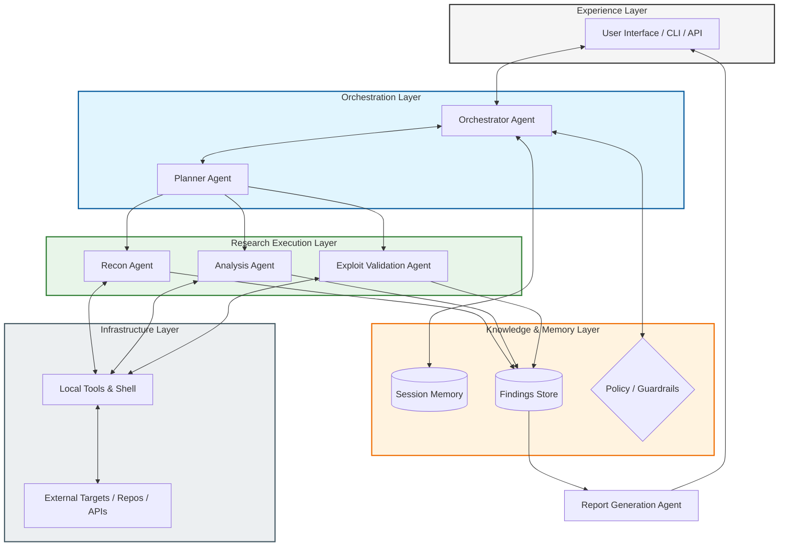

# CortexSec Multi-Agent Architecture Graph

This architecture maps CortexSec agent roles to a professional, research-based security testing lifecycle (OWASP WSTG, NIST SP 800-115, PTES, CVSS, and MITRE ATT&CK).

## 1) Visualized Agent Types

## 2) Agent Taxonomy (Research-Based)

| Agent Type | Professional Function | Typical Standards Alignment | Deliverable |
|---|---|---|---|
| **Orchestrator** | Coordinates workflow, enforces safety and scope | PTES process control, NIST planning discipline | Approved execution path |
| **Planning** | Defines goals, constraints, and test strategy | NIST SP 800-115 planning phase | Test plan + checkpoints |
| **Recon** | Maps attack surface and entry points | OWASP WSTG information gathering | Target intelligence map |
| **Vulnerability Analysis** | Correlates signals into vulnerability hypotheses | OWASP WSTG test cases, CWE-style reasoning | Prioritized findings |
| **Validation** | Performs safe reproduction and rejects false positives | NIST technical testing rigor | Evidence-backed confirmations |
| **Reporting** | Produces technical + executive outputs and prioritization | CVSS scoring, MITRE ATT&CK mapping | Final assessment report |

## 3) Layered Architecture View

## 4) End-to-End Evidence Lifecycle

1. **Scope & Authorization** - Confirm legal scope, target boundaries, and non-destructive constraints.
2. **Intelligence Collection** - Gather endpoint/service/configuration observations.
3. **Hypothesis & Prioritization** - Model likely weakness classes and rank by risk likelihood.
4. **Controlled Validation** - Reproduce behavior safely with traceable commands and outputs.
5. **Risk Translation** - Convert technical evidence to business impact and remediation actions.
6. **Delivery & Auditability** - Publish findings with reproducible evidence lineage.

## 5) Design Principles

- **Safety-first execution**: authorized targets, bounded methods, non-destructive techniques.
- **Evidence-before-assertion**: no confirmed finding without reproducible proof.
- **Separation of duties**: discovery, analysis, validation, and reporting remain distinct.
- **Audit readiness**: each conclusion should trace to artifacts and command provenance.
